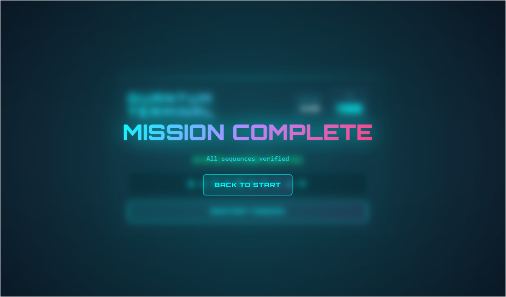

# 🔷 QUANTUM TERMINAL – Sequence Puzzle Game

**A next-generation cyber-themed puzzle experience** inspired by the **Keypad module** from  
🎮 *Keep Talking and Nobody Explodes.*

Engineered as a **competitive event challenge** testing **cognitive processing**, **memory retention**, and **decision-making** under time pressure — all within an **immersive quantum-tech interface**.

---

## 🚀 Live Demo

👉 **[Launch Quantum Terminal](#)** *( https://shreyashgawas777.github.io/Keypad-Sequence-EventGame/ )*

---

## 🧩 Game Mechanics

### Core Concept
- Participants receive a **physical Universal Reference Order sheet** containing 30 unique symbols.
- The terminal displays a **randomized subset** of these symbols in a grid layout.
- **Mission Objective:** Decode and input symbols in their **canonical reference order** (not visual order) before the timer expires.

### Progressive Mission Structure

| Mission | Symbols | Time Limit | Grid Layout | Difficulty |
|:--------:|:--------:|:-----------:|:-------------:|:-------------:|
| 1 | 4 | 60s | 2×2 | Initiation |
| 2 | 6 | 120s (2m) | 3×2 | Intermediate |
| 3 | 10 | 180s (3m) | 5×2 | Expert |

**Failure Conditions:**
- ❌ Incorrect symbol selection (instant mission abort)  
- ⏱️ Timer expiration  
**Penalty:** Restart from Mission 1  

**Victory Condition:**  
✅ Successfully decode all 3 missions sequentially.

---

## ✨ Advanced Features

### UI / UX Design System
- **Glassmorphism Architecture** – Multi-layered transparency with blur effects  
- **Quantum Particle Background** – 30 animated ambient particles for depth  
- **State-Driven Visual Feedback** – Dynamic colors communicate state instantly  
- **Micro-interactions** – Hover effects, button physics, tactile feedback  
- **Responsive Grid System** – Optimized from mobile to 4K displays

### Interactive Elements
- ⚡ **Real-time Input Validation** – Instant feedback  
- 🎯 **Smart Symbol Display** – Empty placeholders animate into sequence  
- ⏰ **Warning States** – Timer pulses red when <10s  
- 🏆 **Victory Sequence** – Animated overlay with particle burst  
- 🔄 **Dual Reset Options** – Victory "Back to Start" + persistent abort button

### Audio Feedback System
| Event | Sound Description |
|:------|:------------------|
| 🔊 Click | 440Hz sine wave (A4 note) |
| ✅ Success | Ascending C5→C6 ramp |
| ❌ Failure | Descending sawtooth (150Hz→100Hz) |
| 🎵 Victory | Four-note arpeggio (C4–E4–G4–C5) |

---

## 🎨 Design Philosophy

### Visual Identity: *"Quantum Terminal"*
Merging **cyberpunk data visualization** with **holographic UI principles.**

**Color Palette:**
- **Primary:** Cyan `#00ffff` – Active, success  
- **Accent:** Purple `#b388ff` – Highlights  
- **Error:** Pink `#ff4081` – Failures, warnings  
- **Success:** Green `#00ff88` – Correct selections  

**Typography:**
- **Display:** Orbitron (900) – Titles, headers  
- **UI:** Space Mono – Body text  

**Animation Principles:**
- GPU-accelerated transforms @ 60fps  
- Staggered entrance animations (50ms cascades)  
- Cubic-bezier easing for organic motion  
- Pulse/glow effects for emphasis  

---

## ⚙️ Technical Architecture

### Technology Stack

| Layer | Technology | Purpose |
|:------|:------------|:---------|
| Structure | **HTML5** | Semantic markup, accessibility |
| Styling | **Tailwind CSS + Custom CSS** | Utility-first with advanced animations |
| Logic | **Vanilla JavaScript (ES6+)** | Game state & event handling |
| Audio | **Web Audio API** | Procedural sound synthesis |
| Deployment | **GitHub Pages** | Static hosting & CI/CD |

### Code Highlights
- Centralized **state management** preventing race conditions  
- **Event delegation** for optimal performance  
- **CSS custom properties** for runtime theming  
- **Modular functions** for UI, logic, and audio separation  
- No external dependencies (CDN fonts only)

### Performance Optimizations
- ⚡ GPU-based CSS animations  
- 🎯 `will-change` for predictive rendering  
- 🔄 `requestAnimationFrame` for smooth transitions  
- 📦 Minimal DOM manipulation (innerHTML batching)  
- 🖼️ Transform-only animations (60fps consistency)

---

## 🧠 Educational Value

### Game Development Patterns
- Finite state machines  
- Timer-based challenge loops  
- Progressive difficulty scaling  

### Modern Web Technologies
- CSS Grid & Flexbox  
- CSS keyframes & animations  
- Web Audio API synthesis  
- Event-driven DOM logic  

### UX Engineering
- Feedback loops: *action → reaction → outcome*  
- WCAG AA accessibility contrast  
- Mobile-first design principles  
- Loading & error states  

### Visual Design Systems
- Design tokens & theming  
- Glassmorphism effects  
- Particle animation systems  
- Functional color theory  

---

## 📁 Project Structure
keypad-sequence/
├── index.html # Main game file (all-in-one)
├── reference-guide.md # Printable symbol reference
├── /screenshots/
│ ├── terminal-start.png
│ ├── mission-active.png
│ ├── victory-screen.png
└── README.md

---

## 🎯 Usage Instructions

### For Event Organizers
**Preparation:**
1. Print the Universal Reference Order guide  
2. Distribute to participants  
3. Allow 2–3 minutes for memorization  

**Gameplay:**
1. Navigate to the live demo URL  
2. Click **“INITIALIZE SEQUENCE”** to begin  
3. Monitor timer & assist as needed  

**Victory:**
- Players see **“MISSION COMPLETE”** overlay  
- Click **“BACK TO START”** for next participant  


🔮 Future Roadmap
Phase 1: Enhanced Gameplay
Difficulty Modes: Casual (90s) / Expert (30s)

Leaderboard System (localStorage)

Practice Mode (no timer)

Hint System (highlight next symbol)

Phase 2: Technical Upgrades
PWA implementation (offline play)

React migration (component-based)

Backend multiplayer & leaderboards

Analytics dashboard

Phase 3: Polish & Accessibility
Sound toggle & theme switcher

Screen reader support (ARIA, keyboard nav)

Custom symbol upload support

📸 Visual Showcase
State	Description
Idle	Glowing container with initialization prompt
Active	Symbol grid + real-time countdown
Success	Green pulse animation, sequence verified
Failure	Red shake animation, error display
Victory	Full-screen overlay + particle effects

🤝 Contributing
Contributions welcome! Areas of interest:

New symbol sets (Cyrillic, Asian, icons)

Audio & accessibility improvements

Performance optimizations


📄 License
This project is open source under the MIT License.

🙏 Acknowledgments
Inspiration: Keep Talking and Nobody Explodes by Steel Crate Games

Typography: Orbitron & Space Mono

Styling: Tailwind CSS

Design Influence: Cyberpunk UI/UX & Quantum Computing Interfaces

📬 Contact
Developer: Shreyash Gawas
Project Link: https://github.com/shreyashgawas777/Keypad-Sequence-EventGame

<div align="center">
⚡ Built with passion for immersive web experiences ⚡
<br>




</div> ```